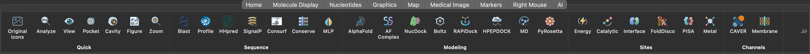
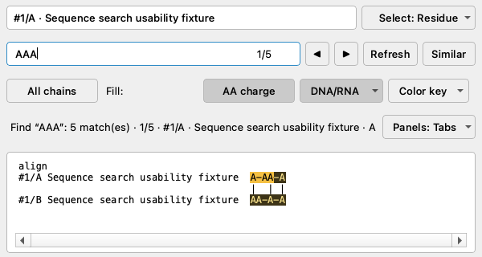
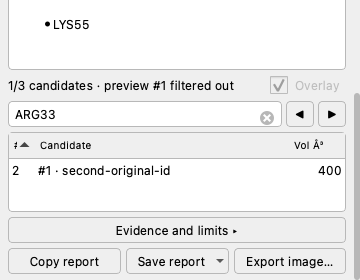
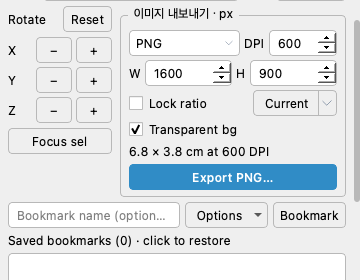

# ChimeraXbridge

**Version 0.2.1 · UCSF ChimeraX 1.10.x · tested on macOS with ChimeraX 1.10.1**

ChimeraXbridge adds a searchable sequence panel, compact molecular controls,
camera bookmarks, publication image export, six local Quick actions, and an
optional AI assistant inside ChimeraX.

**The sequence panel, display controls, bookmarks, image export and Quick buttons work without an AI account.**
To give the AI assistant tasks in natural language, sign in to your chosen service
or configure your own API key separately. External analysis programs and personal
credentials are not included in the plugin.

## Installation: use the same plugin on another computer

1. Download **[ChimeraX_CodexBridge-0.2.1-py3-none-any.whl](https://github.com/JAEYOONSUNG/ChimeraXbridge/releases/download/v0.2.1/ChimeraX_CodexBridge-0.2.1-py3-none-any.whl)**
   from the [latest release](https://github.com/JAEYOONSUNG/ChimeraXbridge/releases/latest).
   Download the `.whl` file instead of GitHub's **Source code** archive to skip the build step.
2. Install it from the ChimeraX command line using the path to the downloaded file.

   ```chimerax
   toolshed install "~/Downloads/ChimeraX_CodexBridge-0.2.1-py3-none-any.whl"
   ```

   Adjust the path if you downloaded the file to a different folder. Put paths containing spaces in quotes.
3. Restart ChimeraX to finish installation. On a fresh installation, the sequence
   panel opens automatically, the right-side panels use tabs, DNA/RNA colors are
   muted, and image export defaults to transparent PNG at 300 DPI.

**Just install → restart.** No extra setup commands or Codex account are required.
Updates preserve your saved display settings.

[v0.2.1 release](https://github.com/JAEYOONSUNG/ChimeraXbridge/releases/tag/v0.2.1) ·
[Detailed installation, update and AI connection guide](INSTALL_REPRODUCIBLE.md)

The wheel contains the plugin code, toolbar icons, built-in help and workspace
defaults. Install it through **ChimeraX**, rather than system Python.
Local sequence, display, bookmark, export and Quick workflows need no AI login.
Geometric cavity analysis requires optional `pyKVFinder`; without it, the result
explains the fallback used and does not invent cavity measurements.

## What is new in 0.2.1

- A fresh installation starts with the shared UI defaults after restarting;
  existing saved preferences are preserved when upgrading.
- **Setup** now accepts an OpenAI API key directly in a masked dialog, with
  optional connection checking and a key kept only for the current app session.
- CLI setup uses the supported Codex/Claude login commands and Gemini's
  interactive sign-in flow.

## Workspace features

- The sequence panel opens at startup, with guides every 10 residues, muted
  nucleotide palettes, and a persistent search count, including overlapping motifs.
- Eight right-side panels scroll through their complete contents. Nested lists
  and evidence text scroll first, then the containing panel; scrolling over
  sliders and number fields does not accidentally change their values.
- The six **AI → Quick** buttons run local actions immediately, with background
  calculations, ranked candidates, cancellation, cached results and visual undo.
- **Quick Results** adds numeric sorting, filtering, an explicit current-preview
  indicator, and CSV/JSON/Markdown reports that retain every candidate.
- **Bookmarks** combines saved scene conditions, compact X/Y/Z controls, and
  PNG/JPEG/TIFF export with size, DPI, aspect lock and convenient size presets.
- Collapsed Action Pad branches, candidate filters, **Hide All**, and zero
  transparency settings survive the relevant panel refreshes.

### Interface examples



The sequence/report/export examples below were rendered offscreen for 0.2.0
using synthetic data. These controls also apply to 0.2.1; the displayed candidates
are not scientific results.

| Sequence search and palette controls | Filtered candidate and preview status | Image size, DPI and bookmarks |
| --- | --- | --- |
|  |  |  |

## Examples you can follow

### 1. Inspect a structure without an AI account

Open a local PDB or mmCIF file through **File → Open**, then choose a structure in
**Models**, or select residues in the sequence/3D view. Click the **AI** toolbar tab:

| Quick button | What happens |
| --- | --- |
| **Analyze** | Reports composition, ligand/metal contacts, selection context and measured evidence. |
| **View** | Tidies cartoons, nucleic bases, ligands and ions while keeping existing colors and camera angle. |
| **Pocket** | Shows a ranked observed ligand neighborhood; tries geometric candidates when no usable ligand is present. |
| **Cavity** | Runs optional KVFinder geometry in the background and shows a translucent mesh with measured volume/depth. |
| **Figure** | Applies a clean white-background figure style, retains structure colors and offers image export. |
| **Zoom** | Focuses selected residues, otherwise an observed ligand/ion neighborhood, otherwise the model overview. |

The automatic target is selected atoms, then the highlighted model, then the
largest visible structure. **Quick Results** identifies the actual target and
reports the evidence and limitations. Repeating unchanged input reuses its result.

For example, click **Pocket**, sort candidates by **Contacts**, and type a ligand
name into the filter. Use the arrows or select a row to compare candidates. A
filter only changes the table; the preview label tells you which candidate is
actually displayed, even if its row is hidden by the filter. **Overlay** hides
generated surfaces/labels without hiding the structure.

**Save report → CSV / JSON / Markdown** saves all candidates, original ranks,
measurements, units, evidence and input provenance. Sorting and filtering never
discard report data. **Undo view** restores up to three recent visual steps.
**Run again** retains an explicitly chosen target; its menu also offers
**Recalculate without cache**.

Results are cached up to 64 MiB/eight entries. Structural edits, model moves,
renames, ID changes and closures mark affected results stale and hide invalid
previews. Cosmetic changes keep calculations reusable. Geometric candidates and
nearby residues are observations, not proof of binding affinity or catalysis.

### 2. Find a motif and use quieter nucleotide colors

```chimerax
codex seqbar
```

Choose a chain, or an all-chain/alignment view, then use the search field.
**Ctrl/Cmd+F** focuses search in the panel, the counter shows the current/total
matches, and **Esc** clears the focused query. Overlapping matches remain separate:
searching `AAA` within `AAAA` finds two occurrences. Guides mark groups of 10
residues or alignment columns.

Use the **DNA/RNA** arrow menu to choose **Muted bases**, **Purine / pyrimidine**,
or **Monochrome**. The main button toggles nucleotide fills; **Color key** explains
the selected palette. These sequence palettes do not recolor the 3D structure.

The sequence panel follows residue selection, shown side chains and aligned
structures. To export a structure-derived sequence alignment report:

```chimerax
codex structalign
```

### 3. Save the exact view, then export a figure

1. Open **Molecule Display → Bookmarks**. Use **X / Y / Z** for compact axis controls.
2. In **Options** beside **Bookmark**, choose the conditions to remember: camera,
   pivot, clipping/model positions, display styles, colors/transparency,
   lighting/background, and optionally selection. Save the bookmark.
3. Save the ChimeraX session as `.cxs` to retain those bookmarks with the structure.
4. In the same panel's image controls, choose **PNG**, set **2400 × 1600 px** and
   **300 DPI**. Unlock the ratio first if the current view has a different ratio.
   The print-size hint reads approximately **20.3 × 13.5 cm**.
   Click **Export** and choose a destination.

**Quick Results → Export image** also opens and scrolls directly to these controls.
The **Current** button uses the current viewport size; its arrow offers **2× view**,
widths **1600 / 2400 / 3840 px**, and **Fit to 32 MP limit**. These presets preserve
the aspect ratio and DPI.

PNG and TIFF support transparent backgrounds; JPEG uses the current background.
DPI is written into the file metadata and is distinct from pixel dimensions.
The panel explains sizes beyond the 32 MP / 16,384 px-per-side limit before saving.

### 4. Keep controls usable in a small window

**AI Assistant**, **Display Controls**, **Action Pad**, **Camera Bookmarks**,
**Quick Results**, **Models**, **CAVER**, and **Cavity Browser** all have full-panel
scrolling. Lists and evidence text retain their own scrolling, and you can reach
the bottom buttons without expanding the window.

In **Action Pad**, expand only the chains you need; collapsed branches and scroll
position are kept when the list refreshes. A/S/H/L/C menus apply actions, show,
hide, label and color to the indicated model, chain, residue or selection.
**Display Controls** provides color, transparency, cartoon/surface/stick controls,
named selections and rainbow palettes. Empty targets are explained next to the
controls, and valid hidden representations remain editable.

## Default workspace settings

These are the defaults for a fresh 0.2.1 installation. No profile command is
needed. Upgrades preserve saved choices, including older color/export defaults.

| Preference | Initial value |
| --- | --- |
| Toolbar / right helper panels | Original icons / tabbed layout |
| Sequence | Visible, All chains, guides every 10 positions |
| Sequence colors | Amino-acid charge fills off; nucleotide fills on, Muted bases |
| Image export | PNG, 300 DPI, aspect lock on, transparent background on |
| Initial export size | The recipient's current graphics viewport |
| Bookmark capture options | Camera, display, colors and lighting on; selection off |

Saved bookmarks, output directories, molecular data and AI credentials are
personal to each installation. Share a `.cxs` session separately when you also
want collaborators to open a particular molecular scene.

To deliberately reset an existing installation to these UI defaults later, the
compatibility command `codex profile jaeyoon apply true` remains available.
It is an optional ChimeraXbridge setting command, not an account or download step.
It leaves molecular coordinates, 3D colors, selection and camera intact.

## Optional AI assistant

To connect an AI service, open the panel with the commands below, then use **Setup**.
Choose account sign-in through an installed CLI or enter an OpenAI API key.
Manage subscriptions and billing directly with each service; OpenAI API usage is
billed separately from a ChatGPT subscription.

```chimerax
codex tool
codex backend
codex model
```

The AI Assistant's backend selector and **Setup** menu provide two connection routes:

- **Account/CLI login:** choose Codex, Claude or Gemini and use **Setup** to start
  that installed CLI's sign-in flow. Authentication finishes in its terminal/browser;
  the CLI manages its own saved login. Refresh engine status after signing in.
- **OpenAI API key:** choose **OpenAI API** and open **Setup**. Enter your own key
  in the masked field, then click **Use key**. **Check connection** is optional;
  checking alone does not save or activate the key. **Clear session key** removes
  a key activated in this app. The plugin does not save it to disk, shell
  environment, logs or the clipboard; quitting ChimeraX removes it.

Codex's ChatGPT sign-in uses the account's subscription access. The direct OpenAI
API route uses separate API billing; ChatGPT plan credits do not cover API-key
usage. Setup does not purchase a subscription or change billing.
See [OpenAI's authentication documentation](https://learn.chatgpt.com/docs/auth).

Choose **Model** and **Reasoning** in the UI, or use `codex model` and `codex effort`;
available models depend on the selected service and account. `codex model default`
clears a model override. [Detailed connection steps](INSTALL_REPRODUCIBLE.md#optional-ai-connection)
explain key lifetime, checking, clearing and CLI setup.

After configuring an available backend, these are example **ChimeraX commands**:

```chimerax
codex context
ai Explain the ligand contacts around the currently selected residues
ai Align #2 to #1 using the catalytic core and explain the domain shift
codex ask Explain the evidence for a possible metal-binding site in the current selection
```

Replace example model IDs with your open structures. **Agent** mode may change
the scene; **Analyze/Chat** keep suggested commands separate by default. Inspect
`codex context` to see the session summary attached to requests. Depending on the
backend/workflow, context can include model names/IDs, sizes, selection, camera,
recent state changes, reference context and a viewport image.

The assistant also provides an in-app terminal: plain input runs ChimeraX
commands, and `!` prefixes shell commands. Inside that terminal:

```text
show sel
/sequence
/motif
/figure clean
/setup
```

Use **Enter** to submit an assistant request and **Shift+Enter** for a newline.
`codex auto false` disables natural-language fallback in the main ChimeraX command
line. `codex routing` describes the routing modes; `codex selftest` reports local
integration and backend availability. Missing AI credentials do not disable the
local Quick or sequence/display/export tools.

## Additional tools

These launchers extend the local workflows; external services and executables
have their own installation, account and network requirements.

| Area | Available workflows |
| --- | --- |
| Sequence and conservation | BLAST, UniProt search, HHpred, SignalP, ConSurf-lite, 3D conservation comparison, hydrophobicity/MLP coloring and structural MSA reports. |
| Sites and interfaces | Catalytic-residue triage, existing/virtual metal coordination, PISA-style buried interface area, pockets and cavity overlays. |
| Modeling and docking | AlphaFold/AF Complex launchers; local Boltz; RAPiDock native/Docker/HPEPDOCK routes; HPEPDOCK; NucDock through HDOCK. |
| Tunnels and membranes | CAVER preparation/result import/tunnel display, lining-residue selection, virtual membrane slabs and hydrophobicity views. |
| Structure search | Foldseek, FoldMason, FoldDisco, DALI, VAST, PDBeFold/SSM and US-align launchers. |
| Molecular dynamics | Optional OpenMM-based setup when OpenMM is installed in ChimeraX's Python environment. |

The bundle does not install large scientific stacks automatically. **Setup** and
the terminal's `/setup` explain available setup routes. See
[optional dependency notes](INSTALL_REPRODUCIBLE.md#optional-scientific-tools) and
[RAPiDock setup](RAPIDOCK_SETUP.md).

## Install from source and contribute

For the exact release source:

```bash
git clone --branch v0.2.1 https://github.com/JAEYOONSUNG/ChimeraXbridge.git
cd ChimeraXbridge
```

Then run this **inside ChimeraX**, replacing the path with the absolute clone path:

```chimerax
devel install "/absolute/path/to/ChimeraXbridge"
```

Restart after installation. For development on the latest source, clone the
default branch instead. [The install guide](INSTALL_REPRODUCIBLE.md) covers
updates, same-version reinstalls and reproducibility checks.

Run checks without opening or activating a desktop window:

```bash
python3 scripts/run_quality_check.py scroll
python3 scripts/run_quality_check.py panels
python3 scripts/run_quality_check.py export
python3 scripts/run_quality_check.py sequence
python3 scripts/run_quality_check.py quick
python3 scripts/check_release_ready.py
```

The quality runner forces ChimeraX `--nogui` with offscreen Qt and covers actual
widgets, supplied-pixel encoder output, state restoration and background work.
It does not recheck the native OpenGL renderer. Older visible GUI runners are
disabled unless `CODEX_ALLOW_VISIBLE_GUI_TESTS=1` is explicitly enabled after
desktop interaction is authorized.

Plugin license: [MIT](license.txt). UCSF ChimeraX and optional services/tools are
distributed under their own terms.
