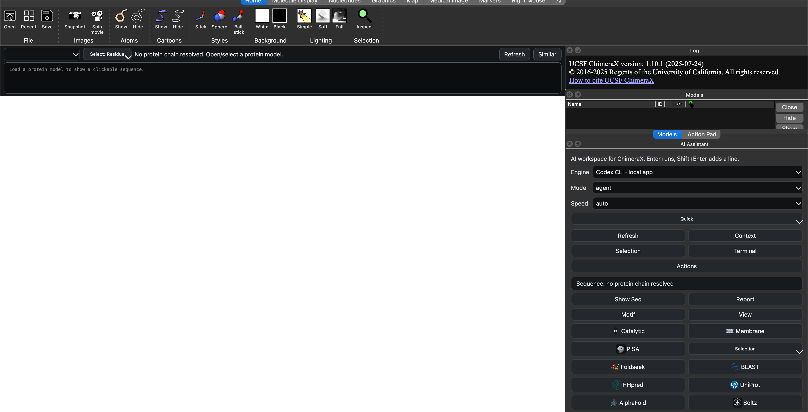
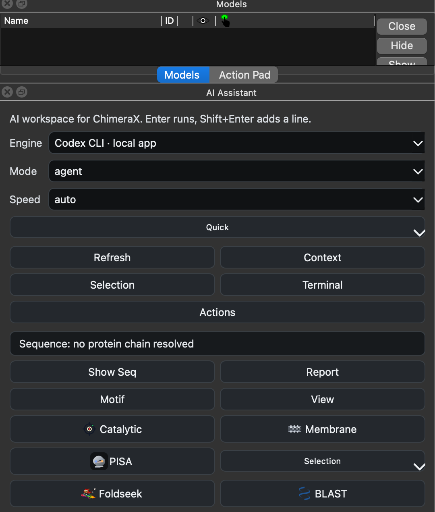

# ChimeraX Codex Bridge

Local ChimeraX bundle that can call installed AI CLIs such as `codex`,
`claude`, and `gemini`, while sending a compact summary of the current
ChimeraX session.

## What it adds

- Unknown multi-word input in the ChimeraX command line can fall back to the active AI backend automatically
- `ai <request>` routes a request through the active backend with a mode-aware speed profile
- `codex tool` opens a ChimeraX-integrated AI workspace with live context, quick actions, and interactive suggestions
- `codex actions` opens a PyMOL-style action pad with A/S/H/L/C controls for models and chains
- The tool defaults to `agent` mode so free-form requests can directly change the ChimeraX scene
- `openai` backend uses the Responses API function-calling loop so the model can call ChimeraX tools directly
- The tool also includes an in-app terminal: plain input runs ChimeraX commands, and `!` prefixes run shell commands
- `codex ask <prompt>` sends your request to the active backend
- `codex backend [name]` shows or switches the active AI backend
- `codex model [name|default]` shows or overrides the active backend model
- `codex auto true|false` toggles command-line natural-language fallback
- `codex context` shows the exact ChimeraX context summary that gets attached
- Analysis prompts now include recent ChimeraX state changes, view metadata, and external structure references
- Codex requests can attach a live viewport snapshot for visual grounding
- Analyze/chat replies are structured around evidence and confidence instead of free-form prose
- Agent planning now uses typed ChimeraX actions instead of a raw command list
- Analyze/chat replies keep suggested ChimeraX commands separate instead of auto-running them by default

## Interface Preview



ChimeraXbridge adds a top sequence bar, AI toolbar entry, model/action controls,
and a right-side AI Assistant workspace inside ChimeraX.



The AI Assistant panel exposes quick actions for sequence reports, motif
highlighting, catalytic-residue triage, membrane views, PISA-style interface
analysis, and structure-search launchers.

## Requirements

- ChimeraX 1.10.x
- Local `codex` CLI installed and logged in, or `OPENAI_API_KEY` set for the direct OpenAI API backend
- If ChimeraX cannot find the CLI, set `CODEX_BRIDGE_CLI` to the full path
  before launching ChimeraX, for example:

```bash
CODEX_BRIDGE_CLI=/path/to/codex \
  /Applications/ChimeraX-1.10.1.app/Contents/bin/ChimeraX
```

## Install

Clone the repository:

```bash
git clone https://github.com/JAEYOONSUNG/ChimeraXbridge.git
cd ChimeraXbridge
```

Install the bundle from inside ChimeraX. Replace `/path/to/ChimeraXbridge` with
the folder you just cloned:

```chimerax
devel install /path/to/ChimeraXbridge
```

On macOS, this usually looks like:

```chimerax
devel install /Users/yourname/ChimeraXbridge
```

Or install from a shell:

```bash
/Applications/ChimeraX-1.10.1.app/Contents/bin/ChimeraX \
  --nogui \
  --cmd "devel install /path/to/ChimeraXbridge ; exit"
```

After installing, restart ChimeraX. If you are actively editing the plugin and
want to reload the UI without reinstalling, run:

```chimerax
runscript /path/to/ChimeraXbridge/scripts/reload_codex_ui.py
```

### Wheel install

A prebuilt wheel is included under `dist/`. This is useful when you want a
copy-style install instead of a development install:

```chimerax
toolshed install /path/to/ChimeraXbridge/dist/chimerax_codexbridge-0.1.0-py3-none-any.whl
```

If ChimeraX reports that `toolshed install` cannot install local wheel paths in
your version, use `devel install` instead.

## Quick Start

After restarting ChimeraX:

```chimerax
codex tool
```

Then use the AI toolbar or type a natural-language request in the ChimeraX
command line, for example:

```chimerax
show the likely catalytic residues
/pisa view
/membrane view
```

## Examples

```chimerax
Align these two structures using only the catalytic core
codex backend gemini
codex backend openai
codex model gpt-5.4
codex model gemini-2.5-flash
ai align #2 to #1 using only the catalytic core
codex context
codex ask Align #2 to #1 using only the catalytic core and explain the domain shift.
codex tool
```

If fallback ever gets in the way of normal command-line work:

```chimerax
codex auto false
```

The bridge sends model names, IDs, structure sizes, and selection summaries by
default. It now also includes camera/view metadata and recent state changes,
and Codex can receive a current viewport image. When available it also folds in
UniProt and RCSB/DALI reference context. It does not dump raw coordinates or
full file contents.

For the direct OpenAI agent backend, set the `OPENAI_API_KEY` environment
variable before launching ChimeraX.

Then inside ChimeraX:

```chimerax
codex backend openai
ai show the catalytic pocket, label the likely residues, and verify the view changed
```

Local evaluation:

```bash
python3 scripts/nl_eval.py
```

In the tool window:

- `Enter` runs the agent
- `Shift+Enter` inserts a new line
- A live workspace pane tracks session context, selection focus, and recommended figure flow
- The AI tool header shows the currently resolved protein chain, sequence length, and default motif hits
- Interactive suggestions can be double-clicked or applied directly back into ChimeraX
- The AI control bar disables unavailable engines and exposes `Setup` actions for CLI login or OpenAI API-key setup
- The visible `Model` and `Reasoning` controls are real overrides passed to Codex CLI, OpenAI Responses API, Claude, or Gemini when supported
- The main AI panel keeps only sequence-focused quick buttons, while analysis launchers live in the grouped `Analysis` menu and ChimeraX `AI` toolbar
- The AI header includes a grouped `Analysis` menu for local reports, sequence/modeling tools, and structure-search launchers
- Display controls open as a separate ChimeraX side tool from `Molecule Display > Display Ctrl`
- The Action Pad stays PyMOL-style: model/chain/selection rows with A/S/H/L/C target menus
- Requests like `구조 예쁘게 정리해줘` or `/figure clean` apply a restrained protein cartoon view without extra labels or repeated recoloring
- Sequence quick controls expose `/sequence`, `/motif`, motif highlighting, and RCSB sequence-similarity search from the current chain
- The transcript pane keeps a terminal-style history of progress, commands, and results
- The in-app terminal accepts raw ChimeraX commands such as `show sel` and shell commands such as `!pwd`
- The `Settings` popup in the AI tool provides secondary mode, speed, backend, and model shortcuts
- Use `/backend`, `/model`, `/speed`, and `/status` to switch between available AI CLIs and quality profiles
- `speed auto` uses fast mode for agent/visual execution and precise reasoning for `analyze` and `chat`
