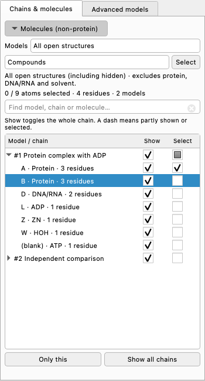

# Chains and molecule selection in Models

Open the **Models** window and choose **Chains & molecules**. This is the
default view in current source builds. The original model/surface list and its
native actions remain available under **Advanced models**.



Offscreen example with synthetic structures; the labels are not analysis results.

## Show and hide chains

Each model expands into its actual molecular chains. Protein and DNA/RNA chains
are labeled by type; other rows show their residue names, such as ADP or ZN.
Blank chain IDs are labeled **(blank)**.

- Click a chain's **Show** checkbox to control its atoms, cartoons and existing
  molecular surfaces together. A model row applies to all its chains.
- A checked box means the chain is shown; an empty box means hidden; a dash
  means only part of the chain is represented. Hidden parent models count as
  hidden even if their atom flags remain enabled.
- Turning a chain off and on restores its previous display styles. Colors,
  molecular coordinates and the camera are retained. ChimeraX Undo/Redo works
  with these actions.
- Highlight a row and click **Only this** to show it and hide the other
  molecular chains. **Show all chains** acts on all open molecular chains,
  including rows excluded by the search filter.

Commands and changes in other panels update the checkboxes automatically.
Searching, refreshing or switching tabs does not change the scene. Search can
use a chain ID such as `A`, a model/chain reference such as `#1/A`, a model name,
or a molecule name. Exact chain IDs take precedence over name substrings.
Searching expands matching model groups; clearing search restores their
previous expansion state.

## Select molecules without amino-acid chains

Use the visible **Molecules (non-protein)** section at the top of the same tab.

1. In **Models**, choose all open structures or a particular structure.
2. Leave the type as **Compounds** to select nonpolymer molecules such as ADP,
   other ligands and ions. This excludes protein, DNA/RNA and solvent.
3. Click **Select**. This replaces the current scene selection; hidden atoms
   are included. **Deselect** removes the target atoms.

Choose **All nonprotein** when DNA/RNA and solvent should also be included.
ChimeraX's native polymer classification is used, so a free amino acid is a
small compound, while amino-acid residues in a protein chain are excluded.

The separate **Select** checkbox in a chain row adds or removes that row's
atoms while preserving other selected objects. Pending appearance edits in
Display Controls are canceled before either selection action can change its
target.

The molecule selector in Models and the one in Display Controls have separate
preferences. Closing a selected model never silently widens molecule selection
to all structures.

## Existing surfaces and verification

Chain visibility works with existing molecular surfaces that retain atom
patches. A shared surface without atom patches cannot safely be divided by
chain. The control explains that case and leaves the scene unchanged; its
whole-surface visibility remains available in **Advanced models**.

The integration checks use real ChimeraX atomic structures, molecular surfaces,
native Model Panel widgets and offscreen Qt. They cover representation
restoration, shared-surface isolation, native Undo/Redo, live state changes,
chain and molecule selection, filtering, short-dock scrolling and cleanup.

```bash
python3 scripts/run_quality_check.py model_chains
```
